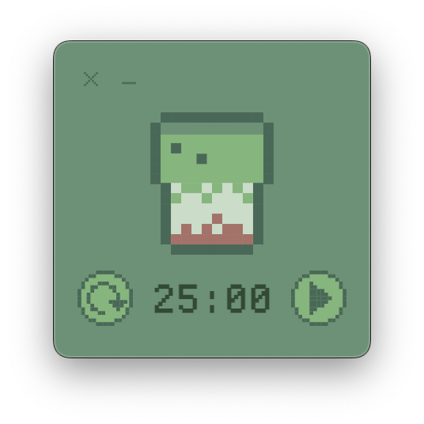

<!-- # 🍵 Matcha Pomodoro -->

<!-- **Matcha Pomodoro** is a minimalist, matcha-themed desktop [Pomodoro timer](https://en.wikipedia.org/wiki/Pomodoro_Technique) (25 minutes of work, 5 minutes of break) built with [Electron](https://www.electronjs.org/) and [Vite](https://vitejs.dev/). It stays as an always-on-top window and has relaxing visuals to help you stay focused during your work sessions!

<p align="center">
  
</p> -->

<table>
  <tr>
    <td width="60%">
      <h1>🍵 Matcha Pomodoro</h1>
      <p><strong>Matcha Pomodoro</strong> is a minimalist, matcha-themed desktop <a href="https://en.wikipedia.org/wiki/Pomodoro_Technique">Pomodoro timer</a> (25 minutes of work, 5 minutes of break) built with <a href="https://www.electronjs.org/">Electron</a> and <a href="https://vitejs.dev/">Vite</a>.</p>
      <p>It stays as an always-on-top window and has relaxing visuals to help you stay focused during your work sessions!</p>
    </td>
    <td>
      
    </td>
  </tr>
</table>

---

## 🖥️ Download

Download the latest `.dmg` release from the [Releases page](https://github.com/divyack2/matcha_pomodoro/releases).

1. Click on the most recent version (e.g. `v1.0.0`)
2. Download the `MatchaPomodoro-x.y.z.dmg` file
3. Open the `.dmg` and drag the **Matcha Pomodoro** app into your **Applications** folder

---

## 🍏 macOS Warning: "Developer Cannot Be Verified"

Since this app isn’t notarized by Apple, macOS might prevent you from opening it.

### ✅ To open the app:

#### Option 1: GUI
1. Go to **System Settings > Privacy & Security**
2. Scroll down to find the message:  
   > “Matcha Pomodoro was blocked from use because it is not from an identified developer.”
3. Click **“Open Anyway”**
4. Then click **“Open”** when prompted again

#### Option 2: Terminal (manual override)
```bash
xattr -d com.apple.quarantine /Applications/Matcha\ Pomodoro.app
```
